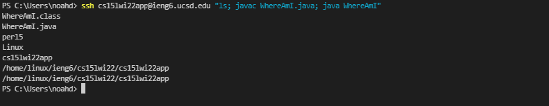

# Lab Report 1: Week 2 - Remote Access

Accessing a remote server to run files from ur local machine is a process that requires deliberate preparation and intention. When deciding to utilize a remote server, one must adhere to the following steps in order to maintain a secure connection that will reliably run programs:
* Install VSCode
* Connect to a Server
* Run Commands
* Move Files
* Setup an SSH Key
* Optimize Remote Running

## Installing VSCode
The first step in accessing a remote server is downloading an IDE, or integrated development environment. IDEs allow us to edit and save the files we work with, as well as interact with our programs thorugh the terminal. In this case, we'll be using VSCode, which can be downloaded for your system [here](https://code.visualstudio.com/download).\
\

\
\
Once your downloaded has completed, open VSCode. You'll be using VSCode to interact with the server from your device, which we'll refer to as the "client" from now on.

## Connecting to a Remote Server
Connecting to a remote server requires a program called OpenSSH, which must be installed on Windows devices via [these instructions](https://docs.microsoft.com/en-us/windows-server/administration/openssh/openssh_install_firstuse) before moving forward.\
\
Once SSH is installed, we can now begin the process of accessing a remote server. This process is done thanks to course-specific accounts, which grant you with specific access to remote systems. Let's begin by signing in and finding your CSE15L account [here](https://sdacs.ucsd.edu/~icc/index.php).\
\
Your account should be in the following format:\
cs15lwi22**AAA**@ieng6.ucsd.edu, where **AAA** is replaced with letters specific to your account.\
\
Next, open VSCode and open a terminal in the top left, or with (Ctrl + Shift + `).

We'll now begin by running our first command:\
`$ ssh cs15lwi22AAA@ieng6.ucsd.edu`\
\
This "ssh" command connects us to the server, and you will likely encounter a message ensuring you wish to connect to this server, since it is your first time. In this case, through the terminal, respond "yes". It will then prompt you for your password, and once entering, you will finally be logged into a remote server!

## Running Commands
Now that we've connected to the server, running commands through the terminal of the client (your computer!) will actually run on the server. As such, it's important to remember when you are running commands on the client versus the server. \
\
Let's practice with the following commands, listed with their respective purposes:
* `cd folderName` - enters directory to specified folder (folderName)
* `mkdir dirName` - creates directory with specified name (dirName)
* `ls` - lists all files in the current directory
* `pwd` - prints working directory
* `scp` - creates a secure copy of the specified file
* `exit` - logs out of the remote server

Now that we've gotten use to running commands on the remote server, let's take a look at how we can move local files over to the server, in order to run them remotely.

## Move Files
To copy files over to the remote server, we'll be using the command `scp`, which will be ran from the client to send over to the server.\
\
The command will be ran in the following format, in this case we are copying the file "WhereAmI.java":\
`scp WhereAmI.java cs15lwi22AAA@ieng6.ucsd.edu:~/`

This will create a secury copy on the remote server, and you can now run the copied .java file remotely!
## Setting Up an SSH Key
An annoying hassle of using `ssh` and `scp` is the constant logging in and out of the remote server, which will repeatedly prompt you for your password. This can take crucial time out of your workflow when jumping between systems. As such, a solution comes in the form of SSH keys. The program `ssh-keygen` produces a pair of keys: a public key to live on the server, and a private key to live on the client. This file pairing replaces your password, allowing you to work more efficiently with the remote server.\
\
To setup an SSH key, run the following command:\
`ssh-keygen`

When prompted to setup a password, simply press enter. This bypasses the need for a password next time you log in. You will now have both keys currently on your system. The next step is to copy over the public key to the `.ssh` directory of the server.\
\
First, login to the remote server. Next, we'll create a directory for the key to reside in:\
`$ mkdir .ssh`

Then, log back out and copy over the public file (named id_rsa.pub) from the client terminal to the server:\
`scp /Users/noahd/.ssh/is_rsa.pub/cs15lwi22@ieng6.ucsd.edu:~/.ssh/authorized_keys`

Next time you `ssh`, you will be quickly logged in without the need to provide your password:

## Optimizing Remote Running
Improving your workflow between the client and server is important when deciding to run programs remotely. When you need to repeatedly alternate between making changes and running your program, it can take a considerable amount of time to complete the required task. Logging in, typing out commands, viewing the output, and making necessary changes can take away from your workflow when not completed efficiently. 

In our own testing, with the WhereAmI.java file mentioned earlier, the entire process of making a single change to a file and running the program can take upwards of 40 seconds. This process also requires over 150 keystrokes for a single change, and considerably more depending on the changes that must be made to the file. When done repeatedly over the course of an entire project, this is obviously a considerable amount of time. Cutting these losses down is an important aspect of using remote access efficiently.

One way this can be done is by combining multiple commands into a single line, to limit the number of individual commands the user needs to pass. To begin, when initially SSH'ing, you can follow your account name with a command between `""`, such as `"ls"`, to immediately run once logged in. You can also combine multiple commands into a single line by dividing them with `;`. The following example shows these two tips combined into a single terminal line:\
`$ ssh cs15lwi22AAA@ieng6.ucsd.edu "ls; javac WhereAmI.java; java WhereAmI"`

With these changes, our keystroke count for logging in, compiling, and running shrinks from over 150 keystrokes to just 72 in a single command!

---
[*Back to Main*](https://njaurigue.github.io/cse15l-lab-reports/index.html)