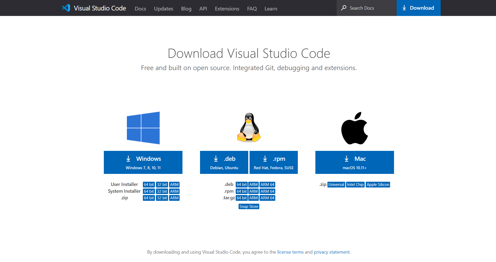

# Lab Report 1: Week 2 - Remote Access

Accessing a remote server to run files from ur local machine is a process that requires deliberate preparation and intention. When deciding to utilize a remote server, one must adhere to the following steps in order to maintain a secure connection that will reliably run programs:
* Install VSCode
* Connect to a Server
* Run Commands
* Move Files
* Setup an SSH Key
* Optimize Remote Running

## Installing VSCode
The first step in accessing a remote server is downloading an IDE, or integrated development environment. IDEs allow us to edit and save the files we work with, as well as interact with our programs thorugh the terminal. In this case, we'll be using VSCode, which can be downloaded for your system [here](https://code.visualstudio.com/download).\
\

\
\
Once your downloaded has completed, open VSCode. You'll be using VSCode to interact with the server from your device, which we'll refer to as the "client" from now on.

## Connecting to a Remote Server
Connecting to a remote server requires a program called OpenSSH, which must be installed on Windows devices via [these instructions](https://docs.microsoft.com/en-us/windows-server/administration/openssh/openssh_install_firstuse) before moving forward.\
\
Once SSH is installed, we can now begin the process of accessing a remote server. This process is done thanks to course-specific accounts, which grant you with specific access to remote systems. Let's begin by signing in and finding your CSE15L account [here](https://sdacs.ucsd.edu/~icc/index.php).\
\
Your account should be in the following format:\
cs15lwi22**AAA**@ieng6.ucsd.edu, where **AAA** is replaced with letters specific to your account.\
\
Next, open VSCode and open a terminal in the top left, or with (Ctrl + Shift + `).

We'll now begin by running our first command:\
`$ ssh cs15lwi22AAA@ieng6.ucsd.edu`\
This "ssh" command connects us to the server, and you will likely encounter a message ensuring you wish to connect to this server, since it is your first time. In this case, through the terminal, respond "yes". It will then prompt you for your password, and once entering, you will finally be logged into a remote server!
## Running Commands
## Move Files
## Setting Up an SSH Key
## Optimizing Remote Running

Here's a Screenshot from Lab 1.png)
[*Back to main*](https://njaurigue.github.io/cse15l-lab-reports/index.html)