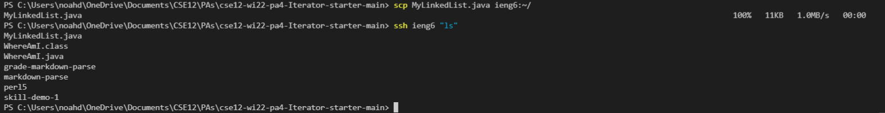

# Lab Report 3: Week 6 - Streamlining SSH  
As part of Lab 5, our group explored a new way to streamline SSH logins. 

In our prior experiences with SSH and remote logins, the process has involved numerous steps before reaching a point where any commands can be ran to test our code. As such, it would be a huge advantage to consolidate these steps (login, account name, password, etc.) to make remote access a much more useful tool.  

In the following report, we detail how a `config` file can be used to streamline SSH logins.

First, we created a new file entitled `config`, which would contain information regarding the host we are trying to connect to and the account we want to login with:  

  

We simply created this file in VSCode, with the "New File" button in the directory we want to work with.  

With this file, we can now use the command `ssh ieng6` to login to our remote account. In this way, we avoid the time-consuming process of typing in our unique username every time we want to connect remotely:

  

By combining this command with commands we've learned previously, we can run commands remotely in a single command line, further reducing the steps and time required to work effectively. In the following example, we copied over a local file to the remote account in a single command line:  

---
[*Back to Main*](https://njaurigue.github.io/cse15l-lab-reports/index.html)