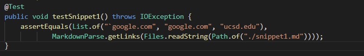
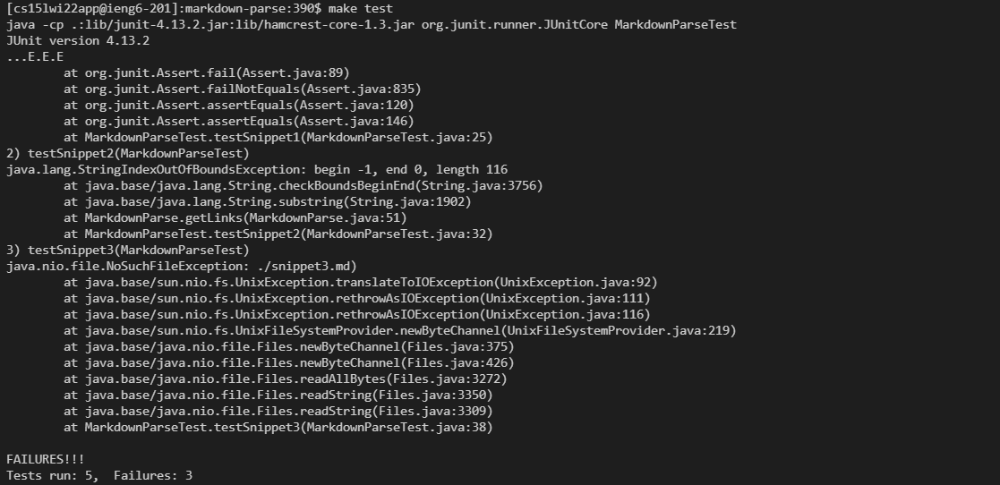
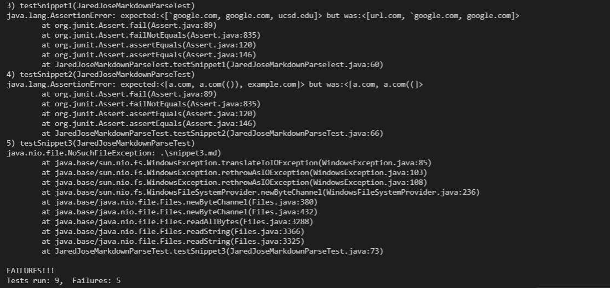
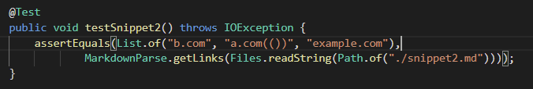
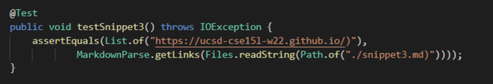

# Lab Report 4: Week 8 - MarkdownParse Tests  
For the last 7 weeks, we've been working with the MarkdownParse program, which which returns all valid links within a given markdown, `.md`, file. Below are two repositories, containing my personal repository of the program along with another student's repository, which we reviewed during our Week 7 lab session.

My Implementation of MarkdownParse:
[https://github.com/njaurigue/markdown-parse](https://github.com/njaurigue/markdown-parse)  

Another Student's Implementation of MarkdownParse (credit - Jared Jose):
[https://github.com/JaredJose/markdown-parse](https://github.com/JaredJose/markdown-parse) 

In the following report, we will review 3 markdown snippets, each with unique cases that will expect different behavior from MarkdownParse. For each snippet, we will examine the expected output, the failing output of our current implementations, and potential changes to produce the expected output.  

## Snippet 1:
```
`[a link`](url.com)

[another link](`google.com)`

[`cod[e`](google.com)

[`code]`](ucsd.edu)
```    
### Expectation
In this first snippet, the unique behavior being tested with MarkdownParse is the use of code within the link (denoted by a backtick) in lines 1 and 2, as well as unmatched opening and closing brackets in lines 3 and 4. When reviewing the markdown preview window in VSCode, which allows us to visualize the expected behavior for markdown files (especially valid links in this scenario) we find that the links in lines 2, 3, and 4 should all be returned by MarkdownParse, while "url.com" in line 1 is invalid and should therefore be omitted.  

### Testing
To appropriately test these markdown characteristics, we added the following test to both implementations of MarkdownParse:  

  

### Outputs
For both implementations, our programs failed to produce the expected output. These failing outputs can be seen here:

#### Personal Implementation  
  

#### Another Student's Implementation
  

As we can see, both tests failed in the `testSnippet1` method.

### Solutions
A simple change that could potentially fix these cases would be to check for opening and closing backticks adjacent to brackets and parentheses. In this way, we can omit any links that occur between these backticks.  

## Snippet 2:
```
[a [nested link](a.com)](b.com)

[a nested parenthesized url](a.com(()))

[some escaped \[ brackets \]](example.com)
```    
### Expectation  
For the second snippet, we are observing markdown behavior when parentheses and brackets are nested within each other, as well as unmatched opening and closing punctuation. For example, in line 2 of Snippet 2, numerous parentheses are nested within each other. Though complex, this would actually produce a valid link for `a.com(())`. Using the VSCode preview once again, we can see that the links `b.com`, `a.com(())` and `example.com` are all valid links and should be included in our output.

### Testing  
With the above information, when then constructed the following test in the JUnit test files of both implementations:

  

### Outputs
Once again, both implementations failed to produce the expected output, as seen below:

#### Personal Implementation  
  

#### Another Student's Implementation
  

As we can see, both tests failed in the `testSnippet2` method.

## Solutions
A change that could be made to MarkdownParse would be tracking the opening parentheses and ensuring they are each matched with an equivalent closing parentheses. Using a structure like a stack, we could push when an opening parentheses is found, and pop when the matching closing parentheses is met. Continuing this process until the stack is empty, we would eventually find which text should be considered a link. This same process could be used for brackets, thus eliminating any links that may be broken due to unmatched punctuation.  

## Snippet 3:
```
[this title text is really long and takes up more than 
one line

and has some line breaks](
    https://www.twitter.com
)

[this title text is really long and takes up more than 
one line](
    https://ucsd-cse15l-w22.github.io/
)


[this link doesn't have a closing parenthesis](github.com

And there's still some more text after that.

[this link doesn't have a closing parenthesis for a while](https://cse.ucsd.edu/


)

And then there's more text
```  

### Expectation
The third and final snippet is testing links containing large spaces and new lines within both names and links. With our understanding of markdown link behavior, these new lines and spaces should not affect their validity as links.By observing the VSCode preview, we confirmed that `https://www.twitter.com`, `https://ucsd-cse15l-w22.github.io/`, and `https://cse.ucsd.edu/` should be included in our output as links, while `github.com` is excluded for missing a closing parentheses.

### Testing  

  

### Outputs
For a third time, both implementations failed to produce the expected output, as seen below:

#### Personal Implementation  
  

#### Another Student's Implementation
  

Both tests failed in the `testSnippet3` method.

### Solutions  
A potential solution for these cases would be to consolidate links by removing spaces and new lines from the fronts and ends of all links. This can be done in a few lines using the `trim()` or `replaceAll()` methods. In this way, we can view potential links in their simplest form, without cluttering items surrounding them. 


---
[*Back to Main*](https://njaurigue.github.io/cse15l-lab-reports/index.html)