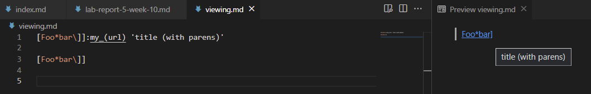
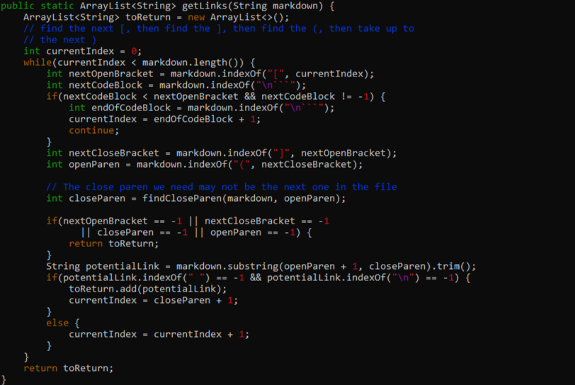
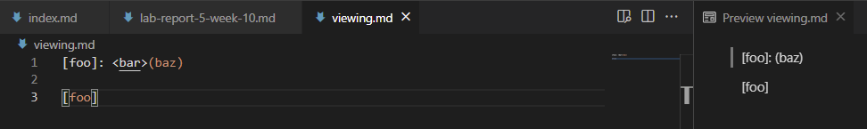
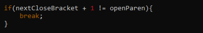

# Lab Report 5: Week 10 - Comparing Tests

In our Week 9 Lab, we used a Bash script to run different implementations of `MarkdownParse.java` on hundreds of files and varying test cases. Through this process, we compared our own implementation with the [provided implementation](https://github.com/ucsd-cse15l-w22/markdown-parse) to examine which markdown files produced varying results. In the following report, we'll examine two specific files and how their differing results were produced.  

## Test File 1 - 194.md  

By using the `diff` command, we can compare our output files from both implementations of `MarkdownParse.java`. With this command, we found that line 212 of our test files contained differing outouts:  

**Personal Implementation:** `[]`  
**Provided Implementation:** `[url]`  

Using the command below, we opened up our output files to the specified line to examine which test file resulted in these outputs:

```
$ vim +212 results1.txt
```  

At this point, we could then see that `194.md` was the test file below which produced the above outputs.  

```
[Foo*bar\]]:my_(url) 'title (with parens)'

[Foo*bar\]]
```  

Next, we used VSCode's preview window to see what should be considered a valid output by markdown standards. With this preview, we found that neither implementation actually returned the correct links. The only valid link, as specified by markdown, is `title (with parens)`. So, the provided implementation appropriately identified a link, but returned the wrong portion of the line.  

  

As such, there are changes that should be made to both files in order to ensure a correct output. In this case, we'll be looking at the provided implementation and see a potential fix to resolve this bug.  

In the case of `194.md`, it seems as though markdown accessed the link by viewing the text between single quotations. As such, we could somehow add a check to MarkdownParse.java to check for text between single quotations in a similar way to how we examined text between parentheses (pictured below). In this way, we can see which punctuation encapsulates the intended link, then parse the appropriate text based on this information.

  

## Test File 2 - 201.md

Using the `diff` command as mentioned previously, we also found a discrepancy at line 230 of our output files:  

**Personal Implementation:** `[]`  
**Provided Implementation:** `[baz]`  

We then accessed our output file precisely at line 230 with the following command:  

```
$ vim +230 results1.txt
```  

We then found that `201.md` below was the input causing a differing output array for our two implementations of MarkdownParse.java.  

```
[foo]: <bar>(baz)

[foo]
```  

Using the VSCode preview once again, we found that the correct output based on markdown standards should be an empty array, since no valid links are present in the file.  

  

Therefore, our personal implementation has the correct output for this test file. We'll take a look at the provided implementation again to see potential fixes for the false output.  

When examining the first line of `201.md`, it's clear to see that "baz" should not be included as a link, because it includes text between the closing bracket and opening parentheses. As such, we should add code to the provided implementation that ensures the indices of these punctuation marks are adjacent to one another, similar to our own implementation as pictured below.  

  

---
[*Back to Main*](https://njaurigue.github.io/cse15l-lab-reports/index.html)